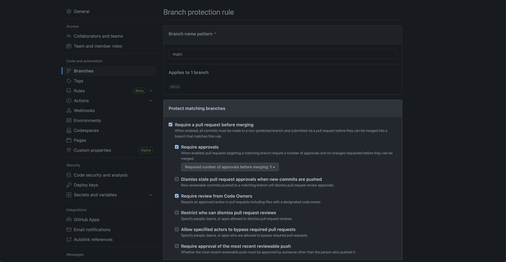

# actions-monorepo

## Simplifying required status checks by standardizing workflow jobs across microservices workflows

The design and administration of monorepos should accommodate new microservices, however these microservices are not exactly alike because they live within the same repository.  Various factors make it difficult to design a single GitHub Actions workflow that satisfies every microservice including:

- programming languages
- build frameworks
- testing requirements

`actions-monorepo` has been designed to use a standard set of GitHub Actions workflow jobs for required status checks, which provides several benefits:

- microservices can have specialized workflows or depend on the default workflow
- pull requests will only require successful status checks from microservices changed
- number of workflows within the repository is minimized


### How does it work

1. Create or update [ruleset](https://docs.github.com/en/enterprise-cloud@latest/repositories/configuring-branches-and-merges-in-your-repository/managing-rulesets) or [branch protection rule](https://docs.github.com/en/enterprise-cloud@latest/repositories/configuring-branches-and-merges-in-your-repository/managing-protected-branches/managing-a-branch-protection-rule) with **Require status checks to pass before merging** containing the workflow job IDs:

   > **Note**
   > Required status checks are case insensitive.

   

1. Create workflows for changes to microservices as necessary

   The following example limits the workflow to trigger for specific microservice and standardizes on the `build`, `test`, and `scan` job IDs:

   ```yaml
   name: CI / Microservice A
   on:
     pull_request:
       branches:
         - main
       paths:
         - "microservices/a/**"
     push:
       paths:
         - "microservices/a/**"
   jobs:
     build:
       name: Build
       runs-on: ubuntu-latest
       steps:
         ...
   
     test:
       name: Test 
       needs:
         - build
       runs-on: ubuntu-latest
       steps:
         ...
   
     scan:
       name: Scan
       needs:
         - test
       runs-on: ubuntu-latest
       steps:
         ...
   ```

   For complete examples, see:

   - [`/.github/workflows/ci-a.yml`](https://github.com/tinyfists/actions-monorepo/blob/b6e3f586bbee8269c5aecaa5a399debba6b175ba/.github/workflows/ci-a.yml)
   - [`/.github/workflows/ci-b.yml`](https://github.com/tinyfists/actions-monorepo/blob/b6e3f586bbee8269c5aecaa5a399debba6b175ba/.github/workflows/ci-b.yml)
   - [`/.github/workflows/ci-c.yml`](https://github.com/tinyfists/actions-monorepo/blob/b6e3f586bbee8269c5aecaa5a399debba6b175ba/.github/workflows/ci-c.yml)
   - [`/.github/workflows/ci-d.yml`](https://github.com/tinyfists/actions-monorepo/blob/b6e3f586bbee8269c5aecaa5a399debba6b175ba/.github/workflows/ci-d.yml)

1. Create workflow for changes to everything else

   The following example ignores specific microservices and standardizes on the `build`, `test`, and `scan` job IDs:

   ```yaml
   name: CI / Default
   on:
     pull_request:
       branches:
         - main
       paths-ignore:
         - "microservices/a/**"
         - "microservices/b/**"
         - "microservices/c/**"
         - "microservices/d/**"
     push:
       branches:
         - main
       paths-ignore:
         - "microservices/a/**"
         - "microservices/b/**"
         - "microservices/c/**"
         - "microservices/d/**"
   jobs:
     build:
       name: Build
       runs-on: ubuntu-latest
       steps:
         ...
   
     test:
       name: Test 
       needs:
         - build
       runs-on: ubuntu-latest
       steps:
         ...
   
     scan:
       name: Scan
       needs:
         - test
       runs-on: ubuntu-latest
       steps:
         ...
   ```

   For complete example, see [`/.github/workflows/ci.yml`](https://github.com/tinyfists/actions-monorepo/blob/b6e3f586bbee8269c5aecaa5a399debba6b175ba/.github/workflows/ci.yml)

## Managing repository access, pull request assignment, and code ownership using nested GitHub teams

Monorepos create an additional challenge regarding permissions and governance as general and microservice-specific concerns must be addressed.

`actions-monorepo` has been designed to leverage [nested teams](https://docs.github.com/en/enterprise-cloud@latest/organizations/organizing-members-into-teams/about-teams#nested-teams) to easily onboard users in multiple ways:

- using parent team to assign default pull request reviewers and require code reviews
- using per-microservice child teams to assign microservice-specific pull request reviewers and require code reviews
- granting repository access through membership in parent or child teams


### How does it work

1. Create parent team with children teams for monorepo and microservices

   

1. Grant `write` repository permissions to parent team

1. Commit code owners file, specifying parent team as default owner, overriding it with children teams per microservice

   ```codeowners
   # Each line is a file pattern followed by one or more owners.
   
   # These owners will be the default owners for everything in the repo.
   # Unless a later match takes precedence, @actions-monorepo will be requested for review when someone opens a pull request.
   
   * @tinyfists/actions-monorepo
   
   
   # Teams can be specified as code owners as well.
   # Teams should be identified in the format @org/team-name.
   # Teams must have explicit write access to the repository.
   
   /microservices/a/ @tinyfists/actions-monorepo-microservice-a
   /microservices/b/ @tinyfists/actions-monorepo-microservice-b
   /microservices/c/ @tinyfists/actions-monorepo-microservice-c
   /microservices/d/ @tinyfists/actions-monorepo-microservice-d
   ```

   For complete example, see [`/CODEOWNERS`](https://github.com/tinyfists/actions-monorepo/blob/bfca31c9cd800cb0351621d9aae79cad69da0d3d/CODEOWNERS)

1. Create or update [ruleset](https://docs.github.com/en/enterprise-cloud@latest/repositories/configuring-branches-and-merges-in-your-repository/managing-rulesets) or [branch protection rule](https://docs.github.com/en/enterprise-cloud@latest/repositories/configuring-branches-and-merges-in-your-repository/managing-protected-branches/managing-a-branch-protection-rule) with **Require a pull request before merging** including:
   - Require approvals
   - Require review from Code Owners

   
