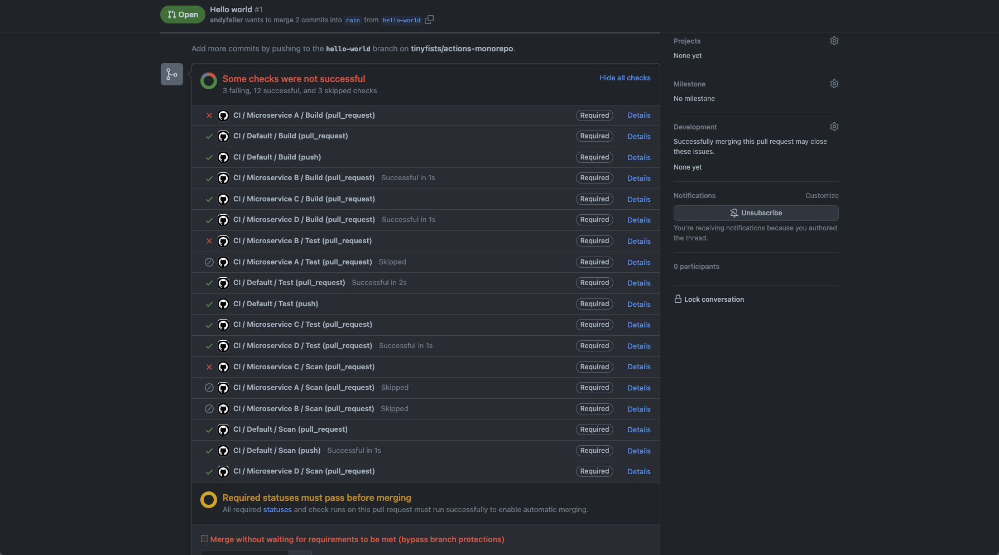
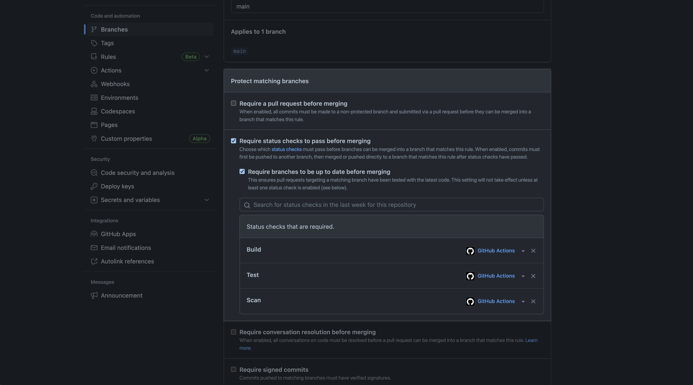

# Simplifying required status checks by standardizing workflow jobs across microservices workflows

The design and administration of monorepos should accommodate new microservices, however these microservices are not exactly alike because they live within the same repository.  Various factors make it difficult to design a single GitHub Actions workflow that satisfies every microservice including:

- programming languages
- build frameworks
- testing requirements

`actions-monorepo` has been designed to use a standard set of GitHub Actions workflow jobs for required status checks, which provides several benefits:

- microservices can have specialized workflows or depend on the default workflow
- pull requests will only require successful status checks from microservices changed
- number of workflows within the repository is minimized



## How does it work

1. Create or update [ruleset](https://docs.github.com/en/enterprise-cloud@latest/repositories/configuring-branches-and-merges-in-your-repository/managing-rulesets) or [branch protection rule](https://docs.github.com/en/enterprise-cloud@latest/repositories/configuring-branches-and-merges-in-your-repository/managing-protected-branches/managing-a-branch-protection-rule) with **Require status checks to pass before merging** containing the workflow job IDs:

   > **Note**
   > 1. Required status checks are case insensitive.
   > 1. Required status checks on branch protection rules must exist before being setup.

   

1. Create workflows for changes to microservices as necessary

   The following example limits the workflow to trigger for specific microservice and standardizes on the `build`, `test`, and `scan` job IDs:

   ```yaml
   name: CI / Microservice A
   on:
     pull_request:
       branches:
         - main
       paths:
         - "microservices/a/**"
     push:
       paths:
         - "microservices/a/**"
   jobs:
     build:
       name: Build
       runs-on: ubuntu-latest
       steps:
         ...
   
     test:
       name: Test 
       needs:
         - build
       runs-on: ubuntu-latest
       steps:
         ...
   
     scan:
       name: Scan
       needs:
         - test
       runs-on: ubuntu-latest
       steps:
         ...
   ```

   For complete examples, see:

   - [`/.github/workflows/ci-a.yml`](https://github.com/tinyfists/actions-monorepo/blob/b6e3f586bbee8269c5aecaa5a399debba6b175ba/.github/workflows/ci-a.yml)
   - [`/.github/workflows/ci-b.yml`](https://github.com/tinyfists/actions-monorepo/blob/b6e3f586bbee8269c5aecaa5a399debba6b175ba/.github/workflows/ci-b.yml)
   - [`/.github/workflows/ci-c.yml`](https://github.com/tinyfists/actions-monorepo/blob/b6e3f586bbee8269c5aecaa5a399debba6b175ba/.github/workflows/ci-c.yml)
   - [`/.github/workflows/ci-d.yml`](https://github.com/tinyfists/actions-monorepo/blob/b6e3f586bbee8269c5aecaa5a399debba6b175ba/.github/workflows/ci-d.yml)

1. Create workflow for changes to everything else

   The following example ignores specific microservices using the same `build`, `test`, and `scan` job IDs as the other workflows to avoid [skipped required status checks](https://docs.github.com/en/enterprise-cloud@latest/repositories/configuring-branches-and-merges-in-your-repository/managing-protected-branches/troubleshooting-required-status-checks#handling-skipped-but-required-checks):

   ```yaml
   name: CI / Default
   on:
     pull_request:
       branches:
         - main
       paths-ignore:
         - "microservices/a/**"
         - "microservices/b/**"
         - "microservices/c/**"
         - "microservices/d/**"
     push:
       branches:
         - main
       paths-ignore:
         - "microservices/a/**"
         - "microservices/b/**"
         - "microservices/c/**"
         - "microservices/d/**"
   jobs:
     build:
       name: Build
       runs-on: ubuntu-latest
       steps:
         ...
   
     test:
       name: Test 
       needs:
         - build
       runs-on: ubuntu-latest
       steps:
         ...
   
     scan:
       name: Scan
       needs:
         - test
       runs-on: ubuntu-latest
       steps:
         ...
   ```

   For complete example, see [`/.github/workflows/ci.yml`](https://github.com/tinyfists/actions-monorepo/blob/b6e3f586bbee8269c5aecaa5a399debba6b175ba/.github/workflows/ci.yml)
